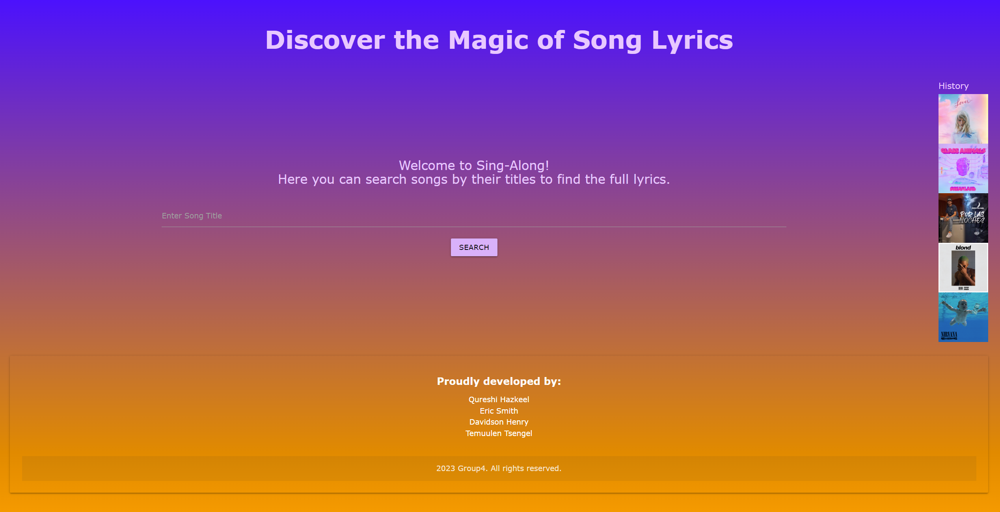
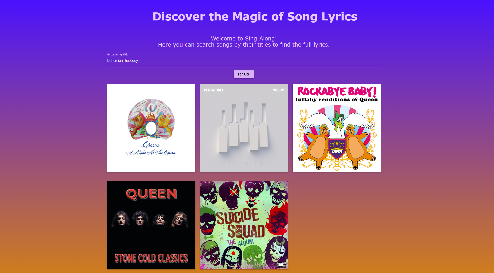
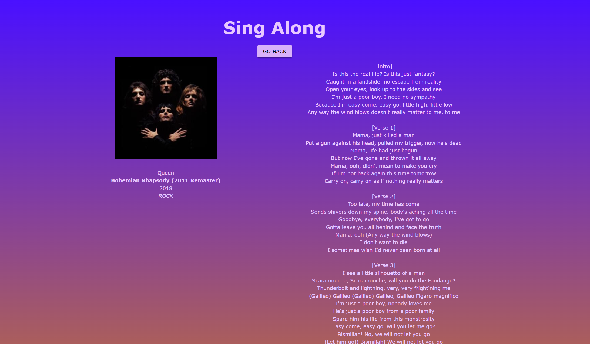

# Sing-Along
Link to deployed page:
https://eric-k-smyth.github.io/sing-along/

## Description
This project was built as a way for someone to search for the lyrics of their favorite songs to give them the ability to sing along!
This project solves information on songs, artists, and lyrics not being displayed in a digestible manner.
This project is a summarization of all we learned for phase 1 of the UofT Coding Bootcamp. With an emphasis on utilizing third party APIs.

## Installation

No installation required, runs in browser, saves to local storage, and automatically authorize user access.

## Usage
Search a song name in the search bar.
The website returns 5 songs with that name.
Select a song by clicking on the image.
The website redirects the user to a page that contains the lyrics to that page.

## Credits
- Hazkeel A. Qureshi https://github.com/hazkeel27
- Dave-Tercey https://github.com/Dave-Tercey
- Temuulen Tsengel https://github.com/temuts
- Eric Smyth https://github.com/Eric-K-Smyth

- Spotify Api https://developer.spotify.com/documentation/web-api
- Genius Api https://docs.genius.com/

## License

MIT License

Copyright (c) [2023] [Eric Smyth, Temuulen Tsengel, Hazkeel Qureshi, Henry Davidson]

Permission is hereby granted, free of charge, to any person obtaining a copy
of this software and associated documentation files (the "Software"), to deal
in the Software without restriction, including without limitation the rights
to use, copy, modify, merge, publish, distribute, sublicense, and/or sell
copies of the Software, and to permit persons to whom the Software is
furnished to do so, subject to the following conditions:

The above copyright notice and this permission notice shall be included in all
copies or substantial portions of the Software.

THE SOFTWARE IS PROVIDED "AS IS", WITHOUT WARRANTY OF ANY KIND, EXPRESS OR
IMPLIED, INCLUDING BUT NOT LIMITED TO THE WARRANTIES OF MERCHANTABILITY,
FITNESS FOR A PARTICULAR PURPOSE AND NONINFRINGEMENT. IN NO EVENT SHALL THE
AUTHORS OR COPYRIGHT HOLDERS BE LIABLE FOR ANY CLAIM, DAMAGES OR OTHER
LIABILITY, WHETHER IN AN ACTION OF CONTRACT, TORT OR OTHERWISE, ARISING FROM,
OUT OF OR IN CONNECTION WITH THE SOFTWARE OR THE USE OR OTHER DEALINGS IN THE
SOFTWARE.
---

## Features

Saves your 5 most recent songs to local storage!
Displays song name, artist name, album name, year created, genre, and lyrics!

